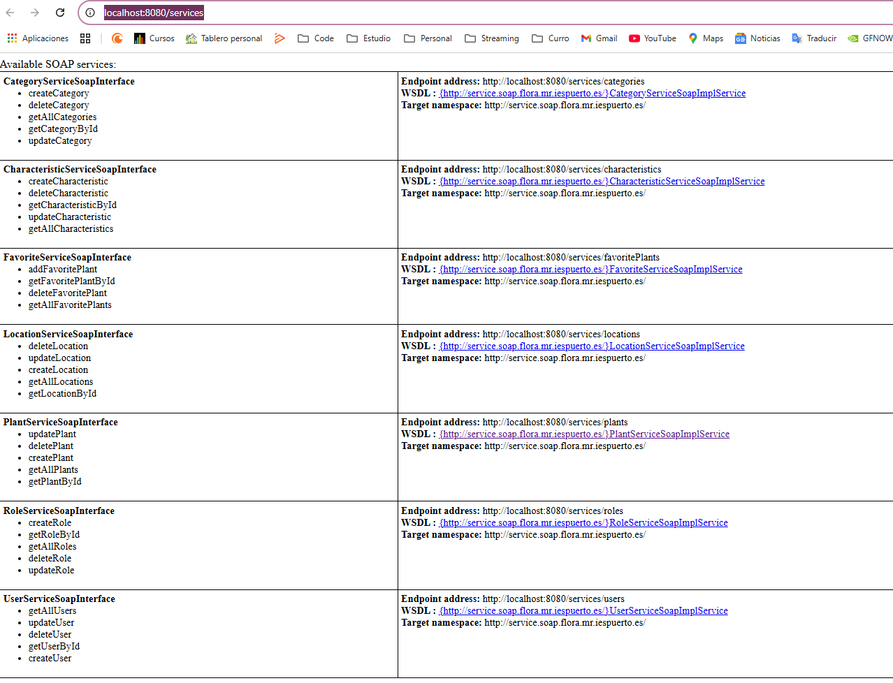
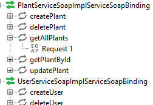
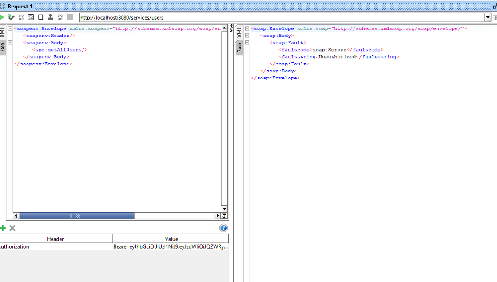
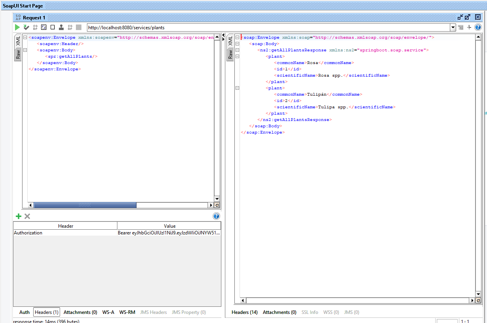

# Aplicación de flora y fauna de Canarias

<div align="center">
    
</div>

Este proyecto implementa una API SOAP utilizando Java y CXF para gestionar usuarios, roles, plantas, categorías, animales, isla, y zonas. El objetivo es permitir la creación, lectura, actualización y eliminación de datos relacionados con la flora y fauna de Canarias.

## Índice
1. [Documentación](./documentacion/)
2. [Changelog](./CHANGELOG.md)
3. [Servicio](./flora/)

## Descripción
Este servicio permite obtener datos detallados sobre la flora y fauna de las Islas Canarias. Se pueden realizar operaciones CRUD sobre los diferentes recursos gestionados por la API.

## Todos los servicios 
Cuando ejecutemos la aplicación (en el readme más adelante puedes ver como ejecutar si no sabes hacerlo), si nos dirigimos a http://localhost:8080/services podremos ver todos los servicios de la API.
Nos aparece así.  


## Acceder al servicio mediante SOAP UI
Con SOAP UI podemos acceder a todos los requests de los endpoints que tengamos de manera fácil. Una vez tengamos la aplicación, simplemente añadimos WSDL y añadimos los servicios que tengamos. En mi caso por ejemplo uso:
http://localhost:8080/services/plants?wsdl. Así nos aparecerá:  


## Securización
Este servicio está securizado. Vamos a ver un ejemplo con la aplicación SOAP UI en el que si hacemos un fetch de las plantas sin usar el token del login previo, no nos permite. También en el contexto de seguridad tiene en cuenta si eres admin o si eres usuario normal. Si intentamos acceder a un recurso que solo pueden acceder los administradores siendo usuario esto es lo que ocurre:

Una vez autenticados como administrador sí nos permite hacer el fetch:


## Requisitos
- Java 11 o superior
- Maven 3.6.3 o superior
- Spring Boot 2.5.4 o superior

## Instalación
1. Clona el repositorio:
    ```
    git clone https://github.com/mruizgl/flora-canaria-app.git
    ```
2. Navega al directorio del proyecto:
    ```
    cd flora-canaria-app
    ```

## Configuración
1. Abre el archivo `application.properties` y ajusta la configuración de la base de datos según tus necesidades.
2. Crea la base de datos requerida y aplica las migraciones necesarias si las hay.

## Ejecución
1. Compila y ejecuta la aplicación usando Maven:
    ```
    mvn spring-boot:run
    ```

## Pruebas
Para probar el funcionamiento de la API, puedes utilizar herramientas como Postman o cURL para realizar peticiones HTTP a los endpoints disponibles.

## Cobertura de codigo
Cuenta con más de un 80% de cobertura de código


## Desarrollado por
Desarrollado con ❤️ por [Melissa Ruiz](https://github.com/mruizgl)

## Licencia
Este proyecto no tiene una licencia específica.


