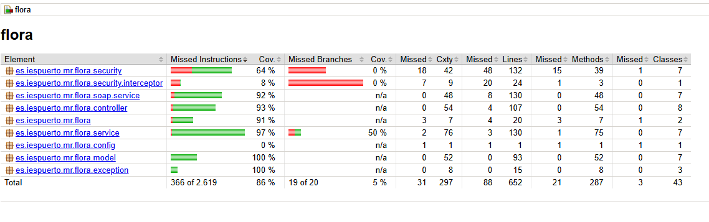
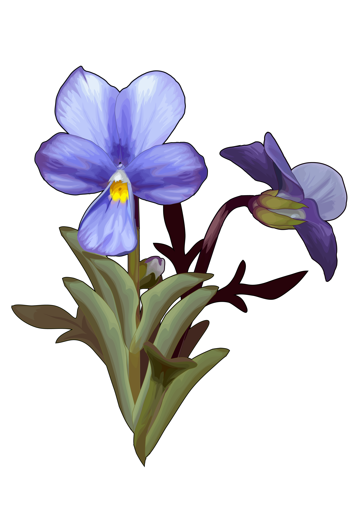

# Aplicación de flora y fauna de Canarias

<div align="center">
    
</div>

Este proyecto implementa una API RESTful utilizando Java y Spring Boot para gestionar usuarios, roles, plantas, categorías, animales, isla, y zonas. El objetivo es permitir la creación, lectura, actualización y eliminación de datos relacionados con la flora y fauna de Canarias.

## Índice
1. [Documentación](./documentacion/)
2. [Changelog](./CHANGELOG.md)
3. [Servicio](./flora/)

## Descripción
Este servicio permite obtener datos detallados sobre la flora y fauna de las Islas Canarias. Se pueden realizar operaciones CRUD sobre los diferentes recursos gestionados por la API.

## Requisitos
- Java 11 o superior
- Maven 3.6.3 o superior
- Spring Boot 2.5.4 o superior

## Instalación
1. Clona el repositorio:
    ```
    git clone https://github.com/mruizgl/flora-canaria-app.git
    ```
2. Navega al directorio del proyecto:
    ```
    cd flora-canaria-app
    ```

## Configuración
1. Abre el archivo `application.properties` y ajusta la configuración de la base de datos según tus necesidades.
2. Crea la base de datos requerida y aplica las migraciones necesarias si las hay.

## Ejecución
1. Compila y ejecuta la aplicación usando Maven:
    ```
    mvn spring-boot:run
    ```

## Pruebas
Para probar el funcionamiento de la API, puedes utilizar herramientas como Postman o cURL para realizar peticiones HTTP a los endpoints disponibles.

## Cobertura de codigo
Cuenta con más de un 80% de cobertura de código


## Desarrollado por
Desarrollado con ❤️ por [Melissa Ruiz](https://github.com/mruizgl)

## Licencia
Este proyecto no tiene una licencia específica.


